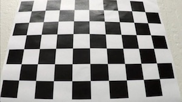
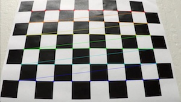
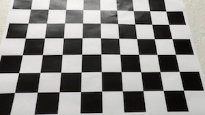
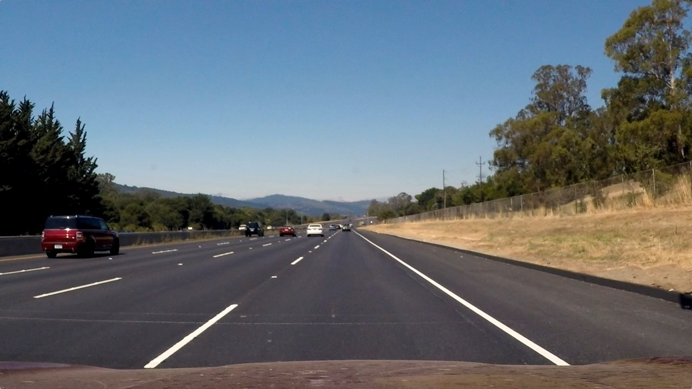
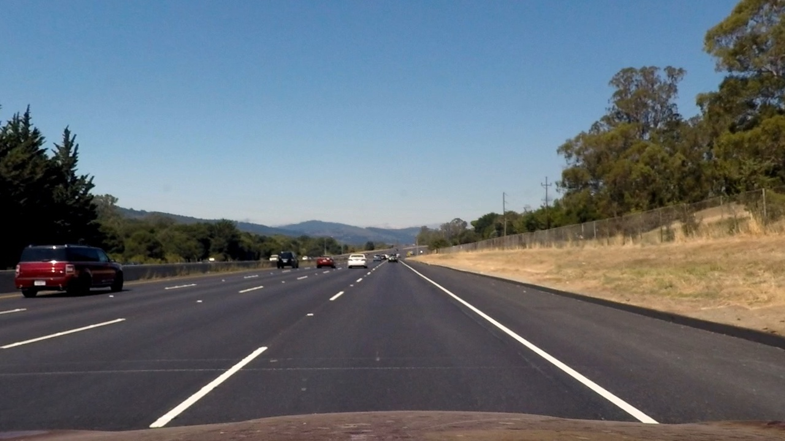
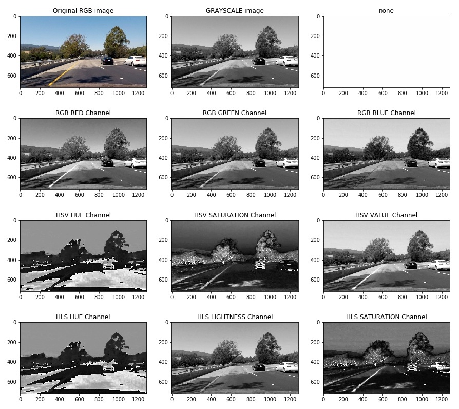
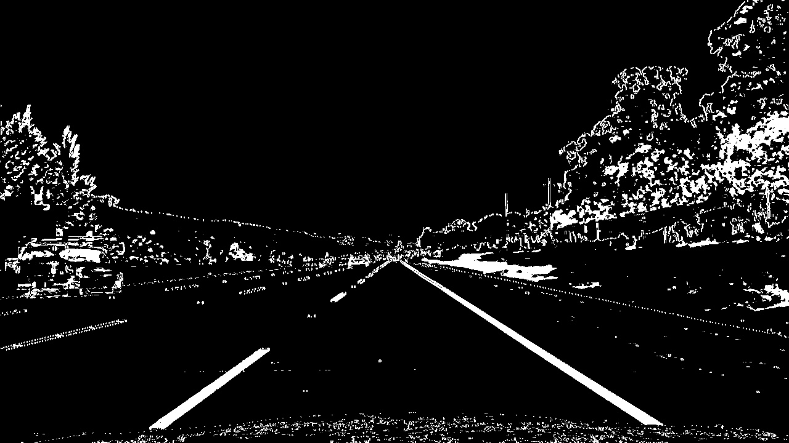
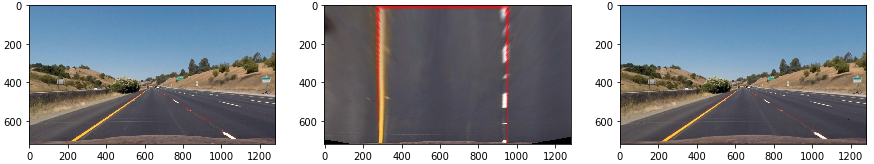
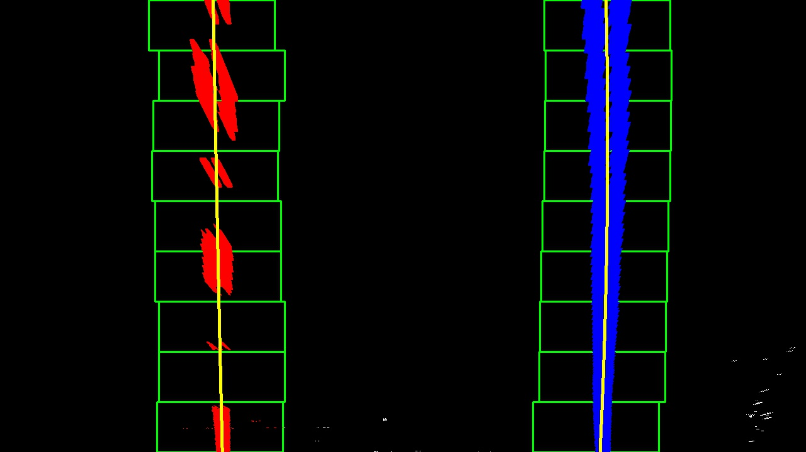
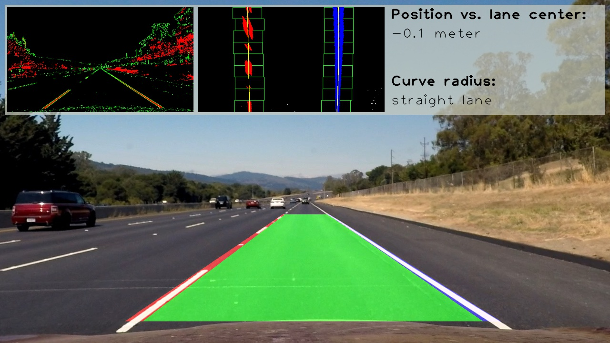

# Advanced Lane Finding Project [P4]
### Summary by Michael Berner, Student @ Udacity Self Driving Car NanoDegree 2018

[](http://www.udacity.com/drive)

Stuttgart, June 4th 2018

---

**Advanced Lane Finding Project**

The goals / steps of this project are the following:

* Compute the camera calibration matrix and distortion coefficients given a set of chessboard images.
* Apply a distortion correction to raw images.
* Use color transforms, gradients, etc., to create a thresholded binary image.
* Apply a perspective transform to rectify binary image ("birds-eye view").
* Detect lane pixels and fit to find the lane boundary.
* Determine the curvature of the lane and vehicle position with respect to center.
* Warp the detected lane boundaries back onto the original image.
* Output visual display of the lane boundaries and numerical estimation of lane curvature and vehicle position.


## [Rubric](https://review.udacity.com/#!/rubrics/571/view) Points

### Here I will consider the rubric points individually and describe how I addressed each point in my implementation.  

---

## Writeup / README

### 1. Provide a Writeup / README that includes all the rubric points and how you addressed each one.  You can submit your writeup as markdown or pdf.  [Here](https://github.com/udacity/CarND-Advanced-Lane-Lines/blob/master/writeup_template.md) is a template writeup for this project you can use as a guide and a starting point.  

I replaced the Udacity Readme file with my actual writeup. The original Udacity Readme Markdown file can be found [here](./Readme_Udacity.md).

## Code Structure
For this project, I decided to work with two Jupyter notebooks:

* `P4-Advanced-Lane-Finding_Preparation.ipynb` for preparation work / tuning of parameters. It is only working with the sample image files from the directory `./test_images`. The notebook can be run independently.
* `P4-Advanced-Lane-Finding_Final.ipynb` holding the final pipeline with streamlined code. This file is actually processing the video files.

Within this report, I will be using sample image files generated with both scripts. **When I'm referring to actual code and its location, it will always be for the `P4-Advanced-Lane-Finding_Final.ipynb` Jupyter notebook.**  

## Camera Calibration

### 1. Briefly state how you computed the camera matrix and distortion coefficients. Provide an example of a distortion corrected calibration image.

The code for this step is contained in the IPython notebook located in `./P4-Advanced-Lane-Finding_Preparation.ipynb`. Relevant code lines can be found in the entire chapter 1.  

I started by preparing "object points" variable, which will be located in the real world as (x, y, z) coordinates. 

For this step, it was assumed, that the chessboard is fixed at z=0 and only the x and y coordinates have to be defined. 

The amount of object points were defined based on the requirements of the function `cv2.findChessboardCorners()`. This function detects all chessboard corners surrounded by four squares and calculates the pixel coordinates of all `objpoints`. Those pixel coordinates will be stored in a variable `imgpoints`. The calibration images were showing a chessboard with 9 horizontal and 6 vertical inbound nodes. 

For every sucessful detection, the freshly derived `objpoints` and `imgpoints` will be appended to an array. 

These arrays were then used to compute the camera calibration and distortion coefficients using the `cv2.calibrateCamera()` function. The output of this function can be used to undistort images using the `cv2.undistort()` function. The camera calibration factors are stored in the pickle file `./camera_cal_parameters.pkl`

Below you can see the **raw calibration image (left)**, how the **chessboard corners (middle)** were detected and how the **undistorted image (right)** finally looked like. 

  


## Pipeline (single images)

### 1. Provide an example of a distortion-corrected image.

To demonstrate this step, I will describe how I apply the distortion correction to one of the test images like this one:


The undistorted image file is depicted below. Most obvious changes: the horizontal light grayish line in the lower fifth of the image becomes much more straight and the red SUV on the left is longer. 



### 2. Describe how (and identify where in your code) you used color transforms, gradients or other methods to create a thresholded binary image.  Provide an example of a binary image result.

The code I developed for creating a binary image is stored in the function `thresholding(img_rgb)` and is located in the cell "Helper functions". 

Before creating this function, I was having a close look to identify the most suitable combination of color channels.

  

HSV color space is showing lane line attributes less clearly than HLS color space. Thus, HSV will not be used. 

From the HLS color space, Saturation shows lane line attributes with a very high contrast, thus it is a promising candidate for lane detection. However...

* Issue 1: false readings are sometimes occuring in shadows on the road. Shadows seem to have similar saturation values (e.g. test4.jpg) than the lane lines. Solution: The strategy to exclude these areas is to make use of the Hue channel:
    * hue is nearly black for all lane lines
    * hue is nearly white for the shadow areas
    * thus, simultaneously limiting HLS Hue to lower values (e.g. < 100) solves this issue.
* Issue 2: more adjacent lane lines tend to disappear. Solution:
    * regular grayscale information are used additionally to recover these lane line fragments

Instead of just using simple thresholding based on grayscale images, a Sobel horizontal gradient was applied on the gray scale image. Both informations (Saturation with Hue and Sobel X on grayscale) were combined with logical OR. An example for the final combined binary image is shown below.



### 3. Describe how (and identify where in your code) you performed a perspective transform and provide an example of a transformed image.

The code for my perspective transform includes a function called `perspective_transform()`, which appears in the cell "Helper Functions" from line 78 through 100. The `perspective_transform()` function takes as inputs an image (`img`) and the desired `direction` of the perspective transformation. 

The function was defined in a way, that I could use it both for warping to bird's-eye view and also back, using an additional parameter call "direction". 

```python
def perspective_transform(img,direction=1):
    # Function to perform perspective transformation. Transformation is possible in both directions
    # Direction has to be set accordingly:
    #     "direction = 1" : regular image to bird's eye view (forward transformation)
    #     "direction = 2" : bird's eye view to regular image (backward transformation)

	...
      
    # Determine matrix to perform perspective transformation
    if direction == 1:
        M_transform = cv2.getPerspectiveTransform(src,dst)
    elif direction == 2:
        M_transform = cv2.getPerspectiveTransform(dst,src)
    
    # Perform perspective transformation and return warped image
    return cv2.warpPerspective(img,M_transform,(img.shape[1],img.shape[0]), flags=cv2.INTER_LINEAR)
```

I chose to hardcode the source and destination points into the function with the following final points: 

| Source        | Destination   | 
|:-------------:|:-------------:| 
| 188, 675      | 280, 720      | 
| 586, 450      | 280, 0        |
| 694, 450      | 1000, 0       |
| 1092, 675     | 1000, 720     |

While defining the points I made sure to keep all of them centered in order to not introduce some skewing to the images. 

To see if my perspective transform was working well, I verified that my perspective transform was working as expected by drawing the `src` and `dst` points onto a test image and its warped counterpart to verify that the lines appear parallel in the warped image.



* Left image: shows raw img with red polygon drawn onto. 
* Middle image: warped portion of the image
* Right image: the middle image warped back onto original RGB image (replacing nonzero area)

The overall result was satisfying. I was especially surprised, how good the warped back image (right) was looking. 

### 4. Describe how (and identify where in your code) you identified lane-line pixels and fit their positions with a polynomial?

The identification of lane-line pixels is originally based on some of the functions provided with the Udacity training material. Based on these functions, I adapted the code to better suit my needs.

I split the lane detection up into two seperate functions:

`lane_detection_initial(img)`: Function is called whenever lane detection was started freshly or failed in between

`lane_detection_consec(img,left_fit,right_fit)`: Function is called whenever there are enough samples available 

My final lane detection functions can be found in the cell **Lane detection helper functions**. Below you can see an example of the initial lane line detection. 



After a histogram based detection of the two starting points for left and right lane, several search windows are arranged starting from the lower edge of the image. Within these search windows, all detected pixels are fed into a polynomial fit   for the function 

$$ f(y) = A\cdot y^2 + B\cdot y + C $$

This is done for both lines independently. 

In order to make the detection smoother, I decided to introduce a **moving average approach**. In order to still be able to use MoviePy in a simple way, I introduced global variables for this purpose. Before every new video file, they are re-initialized.

```python
def init_global_vars():
    # Prepare global variables
    n_frames = 10     # amount of frames to use for moving averages
    n = 0             # initialize counter variable
    n_left_fits = np.zeros((n_frames,3))   # pre-allocate array for left lane polyfit results
    n_right_fits = np.zeros((n_frames,3))  # pre-allocate array for right lane polyfit results
    n_left_fit_curr = np.zeros((1,3))   # pre-allocate array for left lane polyfit results
    n_right_fit_curr = np.zeros((1,3))  # pre-allocate array for right lane polyfit results
    n_curve_rad = np.zeros((n_frames,1))   
    n_dist_dev = np.zeros((n_frames,1))
    # Conversion factors from pixel to meters
    ym_per_pix = 30/720 # meters per pixel in y dimension
    xm_per_pix = 3.7/700 # meters per pixel in x dimension
    global n, n_frames, n_left_fits, n_right_fits, n_left_fit_curr, n_right_fit_curr
    global n_curve_rad, n_dist_dev, ym_per_pix, xm_per_pix   # declare variables as global
```    

Within the actual pipeline (see cell "Pipeline") you can find the logic which was applied to decide which function to use. 


### 5. Describe how (and identify where in your code) you calculated the radius of curvature of the lane and the position of the vehicle with respect to center.

##### Curve radius
Curve radius code lines can be found as function `curve_radius(left_fit_m, right_fit_m, img_shape)` in the cell "Curve radii and vehicle position on lane helper functions". 

I calculated the lines based on the results of the function fit. The following equation was applied: 

$$ Radius [m] = \frac{(1 + (2 \cdot A \cdot y \cdot c_y + B )^2)^{1.5}}{ | 2 \cdot A  |} $$ 

with $$ c_y = \frac{30}{720} $$ as conversion factor from pixel space to world space in m.

##### Distance to lane center
  
For determining the lateral distance to the center of the lane, the function `veh_position(left_fit, right_fit, im_shape)` was added to the same cell. 

It simply calculates the x position at the lower edge of the image for both lane lines. Based on both lane line x-positions, the center between left and right line is calculated and compared to the image center. 

The result is a distance in pixel, which has to be converted to real world space in meters using the coefficient $$ c_y = \frac{3.7}{700}$$. 

**Convention:** Negative numbers correspond to being left to the lane center.


### 6. Provide an example image of your result plotted back down onto the road such that the lane area is identified clearly.

I implemented this step as several seperate functions in my code. 

Within the cell "Prepare output image with overlayed information" the following functions can be found:

* `birdseye_lane_info()` draws lane information (left line, right line, lane) to an empty black image. The pipeline warps the image output back to regular view and generates an overlay with the undistorted RGB image file.
* `plot_additional_info()` adds a gray box on the top third of the image, including debugging images and the information on curvature and position compared to center.

An example is shown below:



Both for position vs. lane center and curve radius, a moving average of 10 frames is being applied. For curve radii > 3500m, my script outputs "straight lane" instead of very high numbers. 


---

## Pipeline (video)

### 1. Provide a link to your final video output.  Your pipeline should perform reasonably well on the entire project video (wobbly lines are ok but no catastrophic failures that would cause the car to drive off the road!).

Here's a [link to my video result](./output_videos/out1_project_video.mp4)

It can also be checked out at [YouTube](https://youtu.be/8TEPf5QjNGU)

---

## Discussion

### 1. Briefly discuss any problems / issues you faced in your implementation of this project.  Where will your pipeline likely fail?  What could you do to make it more robust?

Since the image segmentation and thresholding logic was tweaked only on a subset of images, it will likely fail for different lighting conditions or different lane line colors.

The following points would be on my To-Do-List, if I was going to improved the code a bit further.

1. **Increase weight of Hue/Saturation detection**: this detection seemed on many images so robust, the code should rely stronger on this information. 
2. **Use Hue information to filter areas in grayscale**: Hue information could be also useful to reduce noise obtained from grayscale image
3. **Compensate bouncing car**: The car's suspension is messing with the curve radius calculation. This could be reduced by calculating the measured lateral distance further away and compensate for the new camera angle. 
4. **Adaptive horizon**: Make the horizon shorter for videos with very windy roads
5. **Rely more on gradient detection**: Reduce thresholding at HSL / Gray image and rely more on thresholds for gradients. This should help improve detection in darker image portions.  

It would be probably very helpful and a lot of fun to spend additional time into this project, realizing the above steps.  